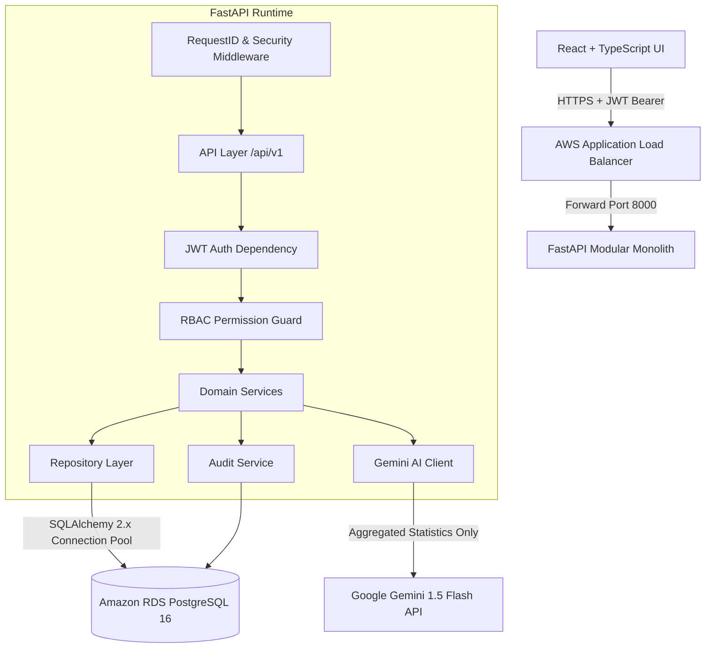

# Architecture Guide: HealthTech Patient Data Dashboard

## 1. Architectural Philosophy: The Modular Monolith

The backend is engineered as a **Modular Monolith** rather than distributed microservices. For a rural healthtech deployment operating in low-bandwidth or resource-constrained regions, distributed microservices introduce operational complexity, network latency, distributed transaction failure modes, and inflated cloud bills.

By adopting a modular monolith:
1. **Low Operational Overhead**: Single deployment artifact, single database migration sequence, predictable memory footprint.
2. **Clear Internal Boundaries**: Modules are organized into strict layers (`api` -> `services` -> `repositories` -> `db/models`). No circular dependencies.
3. **Transaction Integrity**: Clinical encounters and audit logs can participate in ACID transactions without distributed locks or two-phase commits.
4. **Cloud Ready**: Easily scales horizontally on AWS ECS/Fargate behind an Application Load Balancer.

---

## 2. Component Diagram



---

## 3. Layered Design & Separation of Concerns

### A. API Layer (`app/api/`)
- Thin controllers defining HTTP paths, status codes, query parameters, and OpenAPI tags.
- Responsible *only* for request deserialization, dependency injection, and delegating to services.
- **Strict Rule**: Zero database queries or business decisions inside router functions.

### B. Dependencies Layer (`app/dependencies/`)
- Injects database sessions (`get_db`), verifies authentication (`get_current_user`), and enforces RBAC (`require_permission`).
- Handles early denial: if a user lacks the required permission, a 403 Forbidden is immediately raised and an audit record is logged.

### C. Service Layer (`app/services/`)
- Implements core business logic: patient code generation, password verification, token issuance, status transitions, and audit generation.
- Bridges the database repository with external systems like the Google Gemini AI service.

### D. Repository Layer (`app/repositories/`)
- Encapsulates all SQLAlchemy queries and PostgreSQL aggregations.
- Exposes clean methods (`get_by_id`, `get_all`, `count`, `get_encounter_trend_points`).
- Performs aggregations (e.g. disease breakdowns, time-series metrics) directly in the PostgreSQL engine rather than loading raw entities into Python.

### E. Database & ORM Layer (`app/db/` & `app/models/`)
- Models defined via modern SQLAlchemy 2.0 `DeclarativeBase` with typed `Mapped[...]` columns.
- Uses `TimestampMixin` for automatic UTC timestamps.
- Foreign keys with cascading rules (`CASCADE` for patient encounters, `SET NULL` for audit users).

---

## 4. Privacy-Preserving Gemini AI Architecture

```
Clinician Query (e.g., "Why did respiratory infections spike this month?")
       │
       ▼
Authentication & analytics.ai.read Permission Guard
       │
       ▼
Analytics Service aggregates database statistics (PostgreSQL)
       │
       ├── Total encounters in window
       ├── Frequency of top 8 diagnoses
       ├── Age brackets (0-18, 19-35, etc.) and gender breakdown
       └── Monthly disease categorization (respiratory, vector, diabetes, etc.)
       │
       ▼
Verification Gate: Strictly NO Patient Names, Phone Numbers, or Individual IDs
       │
       ▼
Google Gemini API (System Prompt: HealthTech Analytics Assistant)
       │
       ▼
Structured Response Validation { summary, observations, limitations }
       │
       ▼
Audit Log & Return to Clinician
```

### Key Guarantees:
1. **Frontend never talks to Gemini**: The React application has no API keys and cannot initiate queries to Gemini directly.
2. **Zero PII Transmission**: Individual records and patient codes are never sent to Gemini.
3. **Audit Trail**: Every AI query is timestamped and logged with user ID, request ID, and data points analyzed.
